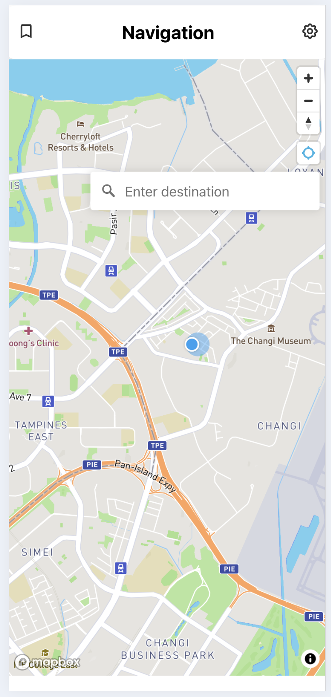
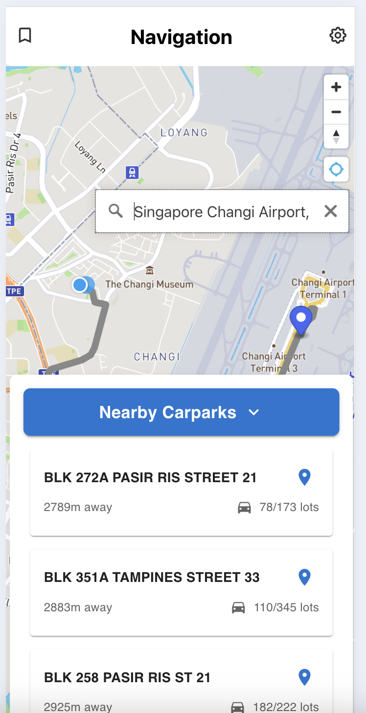
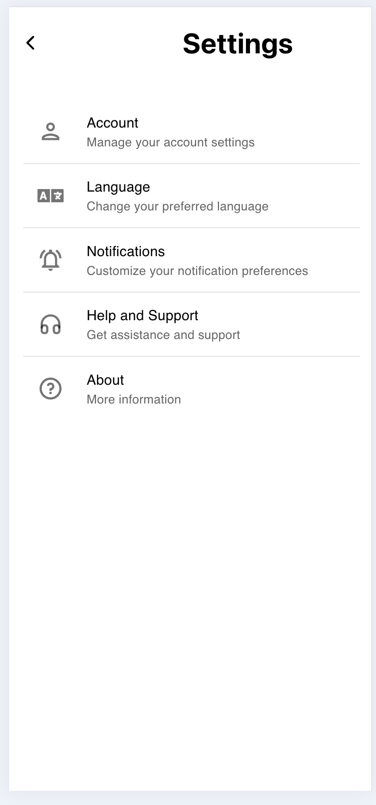

# Carpark Application


A sophisticated web application designed to revolutionize parking space management and discovery. The application leverages advanced algorithms including 2D k-d trees for efficient nearest neighbor searches, providing users with real-time information about nearby parking facilities. Features include intelligent navigation assistance, comprehensive carpark listings, live availability updates, and optimal route planning for seamless parking experiences.

## Preview

<div align="center">

<div style="display: flex; justifyContent: center; gap: 20px;">
    
    
        
</div>

### Preview of the Carpark Application main interface
</div>

## Project Structure

The project consists of two main parts:
- Frontend (React)
- Backend (Flask)
- Container Image (Docker)
- Deployment (AWS)

## Prerequisites

Before running the application, make sure you have the following installed:
- Node.js and npm (for frontend)
- Python 3.x and pip (for backend)
- Required dependencies (see Installation section)

## Installation

### Frontend Setup
1. Navigate to the frontend directory:
```bash
cd frontend
```

2. Install dependencies:
```bash
npm install
```

### Backend Setup
1. Navigate to the backend directory:
```bash
cd backend
```

2. Create and activate a virtual environment (recommended):
```bash
python -m venv venv
source venv/bin/activate  # For Unix/macOS
venv\Scripts\activate     # For Windows
```

3. Install Python dependencies:
```bash
pip install -r requirements.txt
```

## Running the Application

### Start Frontend
```bash
cd frontend
npm start
```
The frontend will be available at `http://localhost:3000`

### Start Backend
```bash
cd backend
flask run
```
The backend API will be available at `http://localhost:5000`

## Development

- Frontend development server includes hot-reloading
- Backend Flask server will automatically restart on code changes if run in debug mode

## Project Status
🚧 Under Development

## License
This project is licensed under the [MIT License](LICENSE).
```
